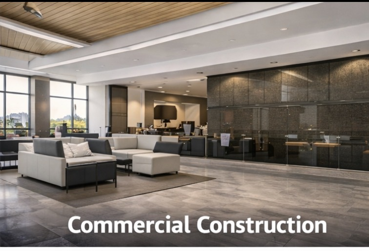
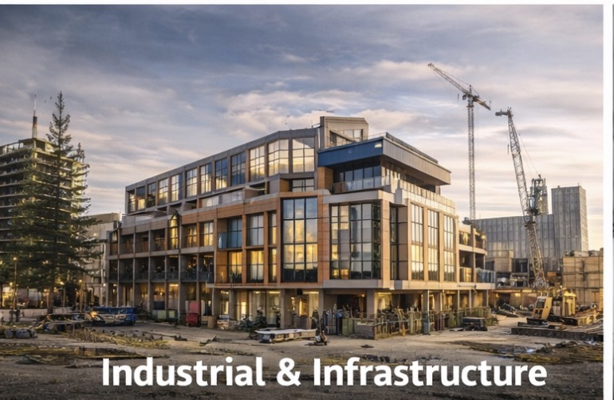
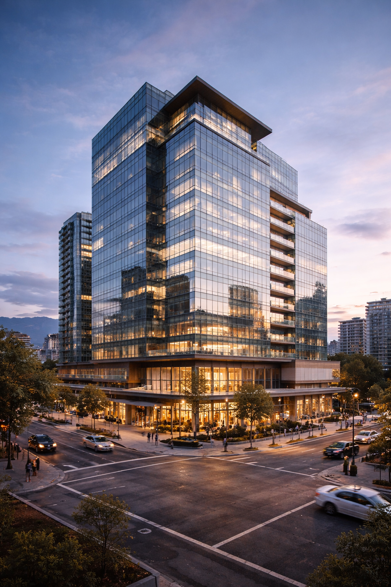
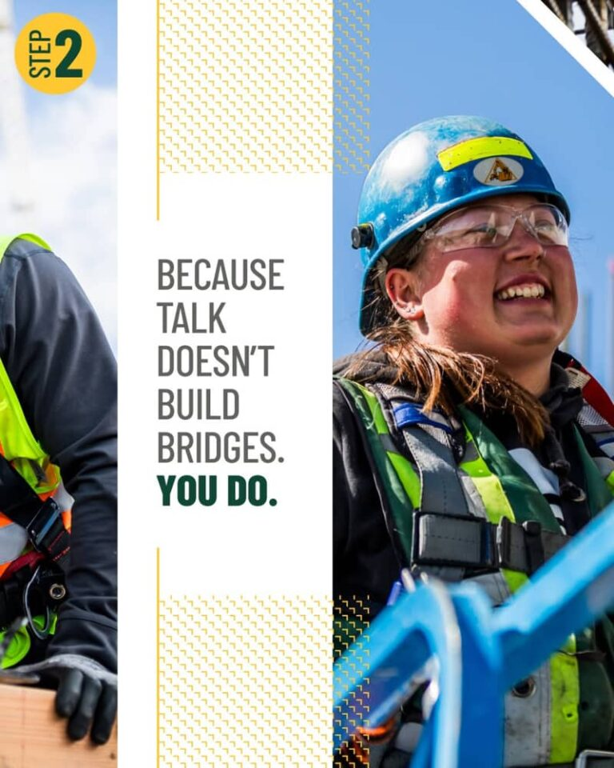
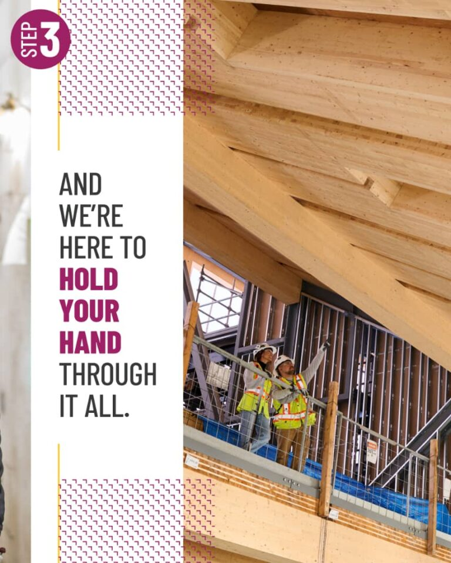
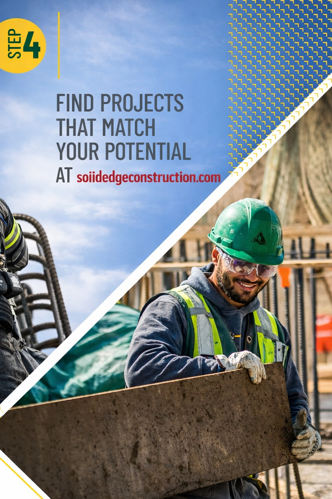

# 161 Powell Road, Brantford, ON N3T OE5  
  
Homepage  
✔ About Us  
✔ Services  
✔ Why Choose Us  
✔ Call to Action  
  
🏗️** ABOUT US**  
  
**Solid Edge Construction Canada**  
*Building with precision. Delivering with integrity.*  
  
  
  
  
At Solid Edge Construction Canada, we bring your vision to life with quality craftsmanship, modern construction methods, and a commitment to excellence. From residential builds to commercial projects, we deliver strong, durable, and beautiful structures you can rely on.  
  
We are a trusted Canadian construction company providing end-to-end solutions—from planning and design to construction and finishing. Every project is handled with professionalism, safety, and attention to detail.  
  
**Our Promise:**  
✔ Quality materials  
✔ Skilled professionals  
✔ On-time delivery  
✔ Transparent communication  
✔ Customer satisfaction  
  
  
  
  
  
🛠️** Who We Are**  
  
**01. Trusted Canadian Expertise**  
Solid Edge Construction Canada started with a small group of dedicated professionals committed to reshaping the construction experience through transparency, superior craftsmanship, and honest business practices. Today, we serve clients across Canada with pride and integrity.    
  
**02. Strong Core Values**  
Our foundation is built on integrity, quality, reliability, and client satisfaction — the principles that guide every project we undertake.  
  
  
  
  
  
  
  
  
**03. Comprehensive Experience**  
From residential projects to large commercial builds, we have grown into a full-service construction company that delivers innovative, efficient, and cost-effective solutions.   
  
**04. Passionate Professionals**  
Our team of skilled architects, engineers, project managers, and builders is dedicated to executing projects to the highest standards while ensuring safety, quality, and communication every step of the way.    
  
  
# OUR LATEST PROJECTS  
  
  
  
**Riverside Residences.**  
**Toronto, ON**  
  
  
  
Northstar Office Tower   
Vancouver, BC  
  
  
  
Eco Green Building  
**Calgary, AB**  
  
OUR SERVICES  
  
  
  
  
  
  
  
  
**Residential Construction**  
  
• New home construction  
• Renovations and remodeling  
• Basement finishing  
• Roofing and exterior work  
• Interior upgrades  
  
**Commercial Construction**  
  
• Office buildings  
• Retail spaces  
• Warehouses  
• Structural upgrades  
• Fit-outs and refurbishments  
  
**General Contracting**  
  
• Project management  
• Site supervision  
• Budget planning  
• Permit assistance  
• Safety compliance  
  
**Design & Build**  
  
• Architectural planning  
• Engineering support  
• Construction execution  
• Final finishing  
  
**FAQ **  
  
**Q: What services does Solid Edge Construction offer?**  
We provide residential, commercial, and industrial construction services, including project management and pre-construction planning.  
  
**Q: Do you handle permits and approvals?**  
Yes. We assist with permit applications and regulatory compliance.  
  
**Q: How do I request a project quote?**  
You can contact us through our website to request a consultation and estimate.  
  
**Q: Do you work nationwide?**  
Yes. We serve clients across Canada.  
  
**Q: How do you ensure project quality?**  
We use certified professionals, high-quality materials, and strict quality control processes.  
